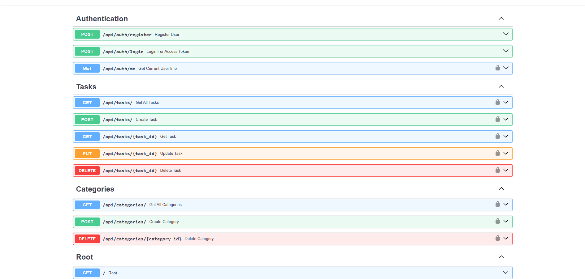

# Smart TaskFlow API

A clean, production-oriented REST API for personal task management. Smart TaskFlow provides secure user authentication, task CRUD operations, categories, filtering, pagination, automatic OpenAPI documentation, and a simple SQLite default setup.

> Built with FastAPI, SQLAlchemy, Pydantic, JWT, and SQLite/PostgreSQL compatibility.


Features
JWT authentication with bcrypt password hashing.

User registration, login, and protected user profile endpoint.

Full task CRUD operations.

Task status and priority filters.

Pagination for task lists.

Category creation, listing, and deletion.

SQLAlchemy ORM with SQLite or PostgreSQL support.

Pydantic request validation.

Interactive Swagger UI and ReDoc documentation.

CORS configuration through environment variables.

Preview
Interactive API documentation
Run the API locally and open /docs.


Architecture
text
smart-taskflow-api/
├── main.py                 # FastAPI application and routes
├── config.py               # Environment-based settings
├── database.py             # SQLAlchemy engine and sessions
├── models/                 # Database models
├── schemas/                # Pydantic request and response schemas
├── routers/                # Authentication, tasks, and categories endpoints
├── utils/                  # Security and authentication dependencies
├── assets/                 # Documentation assets
├── requirements.txt
├── .env.example
└── README.md
Requirements
Python 3.10 or newer.

pip.

SQLite for the default setup, or PostgreSQL for production.

Quick start
Windows PowerShell
powershell
python -m venv venv
.\venv\Scripts\Activate.ps1
python -m pip install --upgrade pip
pip install -r requirements.txt
Copy-Item .env.example .env
python -m uvicorn main:app --reload
macOS or Linux
bash
python3 -m venv venv
source venv/bin/activate
python -m pip install --upgrade pip
pip install -r requirements.txt
cp .env.example .env
python -m uvicorn main:app --reload
Open the application at:

API root: http://127.0.0.1:8000

Health check: http://127.0.0.1:8000/health

Swagger UI: http://127.0.0.1:8000/docs

ReDoc: http://127.0.0.1:8000/redoc

Environment variables
Copy .env.example to .env and configure:

text
DATABASE_URL=sqlite:///./tasks.db
SECRET_KEY=replace-with-a-long-random-secret
ALGORITHM=HS256
ACCESS_TOKEN_EXPIRE_MINUTES=30
DEBUG=True
Never commit .env, credentials, or local database files.

API workflow
Register a user with POST /api/auth/register.

Sign in with POST /api/auth/login and copy the returned access token.

Click Authorize in Swagger UI and enter the token.

Create and manage tasks through the protected task endpoints.

Main endpoints
Area	Method	Endpoint	Purpose
Auth	POST	/api/auth/register	Register a user
Auth	POST	/api/auth/login	Get a JWT access token
Auth	GET	/api/auth/me	Get the current user
Tasks	GET	/api/tasks/	List tasks with filters and pagination
Tasks	POST	/api/tasks/	Create a task
Tasks	GET	/api/tasks/{task_id}	Get one task
Tasks	PUT	/api/tasks/{task_id}	Update a task
Tasks	DELETE	/api/tasks/{task_id}	Delete a task
Categories	GET	/api/categories/	List categories
Categories	POST	/api/categories/	Create a category
Categories	DELETE	/api/categories/{category_id}	Delete a category
Example requests
Register
json
{
  "username": "demo_user",
  "email": "demo@example.com",
  "password": "secure-password-123"
}
Create a task
json
{
  "title": "Review API documentation",
  "description": "Check the README and endpoint examples",
  "status": "pending",
  "priority": "high"
}
Development
Run a syntax check before committing:

powershell
python -m py_compile config.py database.py main.py
Keep local-only files out of version control:

text
.env
venv/
*.db
__pycache__/
Roadmap
Automated pytest test suite.

Alembic database migrations.

Role-based authorization.

Docker and Docker Compose deployment.

Production frontend dashboard.

Search and task sorting.

Contributing
Contributions are welcome. Please read CONTRIBUTING.md before opening a pull request.

License
This project is available under the MIT License.

Author
Built by El-Sombra-Dev.

- GitHub: [El-Sombra-Dev](https://github.com/El-Sombra-Dev)
  
---

## API Documentation Preview

The API includes interactive OpenAPI documentation powered by Swagger UI.

Run the application locally and open:

```text
http://127.0.0.1:8000/docs
```



<div align="center">

**Made with ❤️ using Python & FastAPI By DevZed El-Sombra**

⭐ Star this repo if you find it helpful!

</div>

